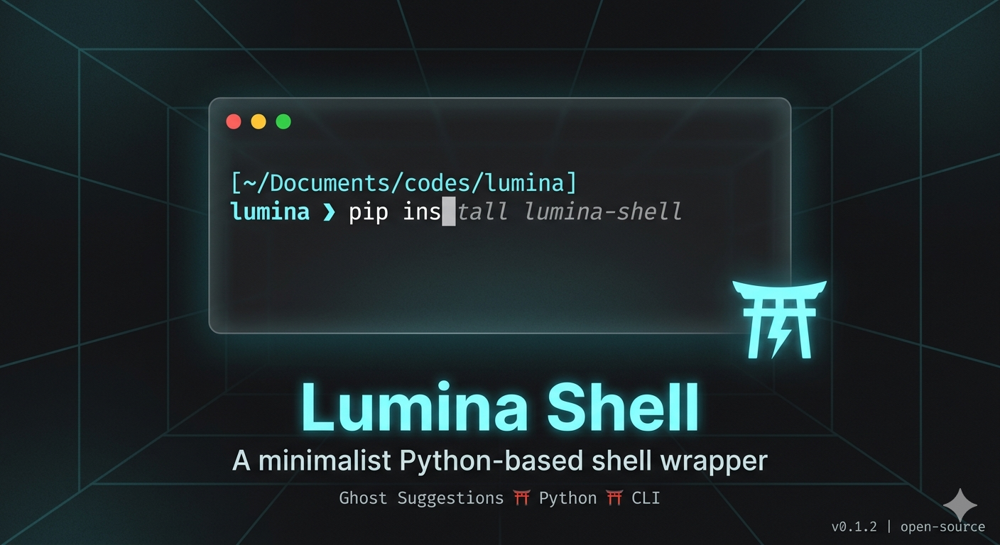

**Lumina** is a lightweight, aesthetic shell wrapper built with Python. It enhances your terminal experience by providing **fish-style ghost text suggestions** based on your command history, stored locally in a JSON database.

---

## 🚀 Features

* **Ghost Text Suggestions:** Real-time, inline command suggestions as you type.
* **Persistent History:** Commands are saved in a local JSON file and persist across sessions.
* **Intelligent Directory Tracking:** Handles `cd` commands internally to maintain your current working directory.
* **Aesthetic UI & Roasts:** Minimalist prompt design with **"Gen Z" roasts** (L + Ratio) when you trigger a "skill issue" (invalid command). 💀

## 🛠️ Installation

1.  **Clone the repository:**
    ```bash
    git clone https://github.com/tahsinzidane/lumina.git
    cd lumina
    ```

2.  **Run the installer:**
    You can install it normally or use the new auto-start flag.
    
    **Standard Install:**
    ```bash
    chmod +x install.sh
    ./install.sh
    ```

    **Auto-Start Mode:**
    To make Lumina your default shell experience every time you open the terminal:
    ```bash
    ./install.sh --auto-start
    ```

3.  **Reload your shell:**
    ```bash
    source ~/.bashrc  # or ~/.zshrc
    ```

## ⌨️ Usage

Simply type `lumina` in your terminal to start the wrapper.

* **Accept Suggestion:** Press the **Right Arrow (→)** or **End** key.
* **Built-in Commands:**
    * `clear`: Clears the screen while maintaining the Lumina session.
    * `cd`: Changes directories within the wrapper.
    * `quit`: Returns to Bash/Zsh.
    * `exit`: Closes the terminal window.


## 🤝 Contributing

This is a personal project, but contributions are absolutely welcome! 
* If you find a bug, please **create an issue**.
* If you want to add a feature, feel free to **submit a pull request**.



## 📝 License

Distributed under the MIT License. See `LICENSE` for more information.